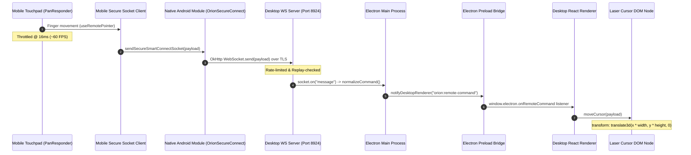

# Orion Connect (Smart Connect v3) - Technical Specification & Code Reference

## Executive Summary

**Orion Connect (Smart Connect v3)** is an encrypted, device-bound, local network remote-control transport protocol connecting **Orion Mobile** (React Native / Expo / Android Native) with **Orion Desktop** (Electron / React).

This document details the end-to-end architecture, source code implementations, IPC messaging pipelines, protocol envelope schemas, performance throttling mechanisms, lag diagnostics, and folder structures for the **laser cursor** and **remote control system**.

---

## 1. End-to-End Control & Laser Pipeline



---

## 2. Source Code Implementations & Explanations

### 2.1 Orion Mobile Laser Cursor Code
**File Link:** [useRemotePointer.ts](file:///c:/Projects/Orion%20-%20A%20Multiverse%20of%20Stories/apps/mobile/src/features/connect/useRemotePointer.ts)

The mobile laser cursor uses React Native's `PanResponder` to track single-finger movement, two-finger scrolling, and taps (clicks). Pan movement is converted into normalized coordinates between `0.0` and `1.0` (`xRatio`, `yRatio`).

```typescript
import { useRef } from 'react';
import { PanResponder } from 'react-native';

type FireAndForgetSender = (action: string, value?: unknown) => void;

export function useRemotePointer(sendRef: React.MutableRefObject<FireAndForgetSender>) {
  const cursorRef = useRef({ xRatio: 0.5, yRatio: 0.5 });
  const gestureStart = useRef({ x: 0.5, y: 0.5 });
  const lastSentAt = useRef(0);
  const lastScrollY = useRef(0);
  const scrollAccum = useRef(0);

  const panResponder = useRef(PanResponder.create({
    onStartShouldSetPanResponder: () => true,
    onMoveShouldSetPanResponder: () => true,
    onPanResponderGrant: (event) => {
      gestureStart.current = { x: cursorRef.current.xRatio, y: cursorRef.current.yRatio };
      lastScrollY.current = event.nativeEvent.touches[0]?.pageY || 0;
      scrollAccum.current = 0;
    },
    onPanResponderMove: (event, gesture) => {
      const now = Date.now();
      // Sender Throttle: Rate limit to ~60 FPS (16ms delta)
      if (now - lastSentAt.current < 16) return;
      lastSentAt.current = now;

      // Two-finger scroll detection
      if (event.nativeEvent.touches.length >= 2) {
        const y = event.nativeEvent.touches[0]?.pageY || lastScrollY.current;
        const deltaY = y - lastScrollY.current;
        lastScrollY.current = y;
        scrollAccum.current += deltaY;
        if (Math.abs(scrollAccum.current) >= 1) {
          sendRef.current('scroll', { deltaY: -scrollAccum.current });
          scrollAccum.current = 0;
        }
        return;
      }

      // Single-finger cursor movement (sensitivity multiplier 0.002)
      const x = Math.max(0, Math.min(1, gestureStart.current.x + gesture.dx * 0.002));
      const y = Math.max(0, Math.min(1, gestureStart.current.y + gesture.dy * 0.002));
      cursorRef.current = { xRatio: x, yRatio: y };
      sendRef.current('cursor_move', { x, y });
    },
    onPanResponderRelease: (event, gesture) => {
      // Tap detection (movement under 5 pixels) triggers a desktop click
      if (event.nativeEvent.touches.length < 2 && Math.abs(gesture.dx) < 5 && Math.abs(gesture.dy) < 5) {
        sendRef.current('cursor_click');
      }
    },
  })).current;

  return { cursorRef, panResponder };
}
```

---

### 2.2 Orion Mobile WebSocket Transport & Complete `sendSecureEnvelope` Chain
**File Links:** 
- [useConnectController.ts](file:///c:/Projects/Orion%20-%20A%20Multiverse%20of%20Stories/apps/mobile/src/features/connect/useConnectController.ts#L284-L302)
- [secureConnectClient.ts](file:///c:/Projects/Orion%20-%20A%20Multiverse%20of%20Stories/apps/mobile/src/features/connect/secureConnectClient.ts#L110)
- [nativeSecureConnect.ts](file:///c:/Projects/Orion%20-%20A%20Multiverse%20of%20Stories/apps/mobile/src/services/nativeSecureConnect.ts#L47)
- [OrionSecureConnectModule.kt](file:///c:/Projects/Orion%20-%20A%20Multiverse%20of%20Stories/apps/mobile/plugins/orion-nsd-native/OrionSecureConnectModule.kt#L135)

#### 1. Client Envelope Wrapper (`secureConnectClient.ts`):
```typescript
export const sendSecureEnvelope = (payload: unknown) => 
  sendSecureSmartConnectSocket(JSON.stringify(payload));
```

#### 2. Native Bridge Dispatcher (`nativeSecureConnect.ts`):
```typescript
export const sendSecureSmartConnectSocket = (payload: string) => 
  requireModule().sendSocket(payload);
```

#### 3. Native Android Module Implementation (`OrionSecureConnectModule.kt`):
```kotlin
package com.okali.orion.smartconnect

import com.facebook.react.bridge.Arguments
import com.facebook.react.bridge.Promise
import com.facebook.react.bridge.ReactApplicationContext
import com.facebook.react.bridge.ReactContextBaseJavaModule
import com.facebook.react.bridge.ReactMethod
import com.facebook.react.modules.core.DeviceEventManagerModule
import okhttp3.*

class OrionSecureConnectModule(private val context: ReactApplicationContext) : ReactContextBaseJavaModule(context) {
  private var socket: WebSocket? = null

  override fun getName() = "OrionSecureConnect"

  @ReactMethod
  fun openSocket(host: String, port: Double, fingerprint: String, ticket: String, deviceId: String, promise: Promise) {
    if (!privateHost(host)) { promise.reject("PUBLIC_ADDRESS_REJECTED", "Smart Connect requires a private LAN address."); return }
    closeSocketInternal()
    val request = Request.Builder()
      .url("wss://${host}:${port.toInt()}/api/socket")
      .header("X-Orion-Ticket", ticket)
      .header("X-Orion-Device", deviceId)
      .build()
    socket = pinnedClient(fingerprint).newWebSocket(request, object : WebSocketListener() {
      override fun onOpen(webSocket: WebSocket, response: Response) {
        emit("orionSmartConnectOpen", Arguments.createMap().apply { putBoolean("open", true) })
        promise.resolve(true)
      }
      override fun onMessage(webSocket: WebSocket, text: String) {
        emit("orionSmartConnectMessage", Arguments.createMap().apply { putString("data", text) })
      }
      override fun onClosed(webSocket: WebSocket, code: Int, reason: String) {
        socket = null
        emit("orionSmartConnectClosed", Arguments.createMap().apply { putInt("code", code); putString("reason", reason) })
      }
      override fun onFailure(webSocket: WebSocket, error: Throwable, response: Response?) {
        socket = null
        emit("orionSmartConnectFailure", Arguments.createMap().apply { putString("code", "WSS_FAILED"); putString("message", error.message ?: "Secure socket failed") })
        if (response == null) promise.reject("WSS_FAILED", error)
      }
    })
  }

  @ReactMethod 
  fun sendSocket(payload: String, promise: Promise) { 
    promise.resolve(socket?.send(payload) == true) 
  }

  @ReactMethod 
  fun closeSocket(promise: Promise) { 
    closeSocketInternal(); 
    promise.resolve(null) 
  }

  private fun closeSocketInternal() { 
    socket?.close(1000, "Client closed")
    socket = null 
  }
}
```

#### 4. Transport Invocations in Controller (`useConnectController.ts`):
```typescript
// Fast-path Cursor Move & Scroll
const sendFireAndForget = (action: string, value?: any) => {
  if (!isConnected || !connectionRef.current.connected) return;
  const sequence = ++sequenceRef.current;
  const command = createRemoteCommand(action, value, deviceId, sequence);
  void sendSecureEnvelope({
    version: SMART_CONNECT_PROTOCOL_VERSION,
    type: 'command',
    deviceId,
    connectionId: connectionRef.current.connectionId,
    sequence,
    commandId: command.id,
    payload: command
  }).catch(() => {});
};

// Remote Media Controls (Play, Pause, Seek, Mute)
const sendRemoteCommand = async (action: string, value?: any) => {
  if (!isConnected || !connectionRef.current.connected) return { ok: false, error: 'Desktop is not live.' };
  if (FIRE_AND_FORGET_ACTIONS.has(action)) {
    sendFireAndForget(action, value);
    return { ok: true };
  }
  const sequence = ++sequenceRef.current;
  const command = createRemoteCommand(action, value, deviceId, sequence);
  markSent(command.id);
  const sent = await sendSecureEnvelope({
    version: SMART_CONNECT_PROTOCOL_VERSION,
    type: 'command',
    deviceId,
    connectionId: connectionRef.current.connectionId,
    sequence,
    commandId: command.id,
    payload: command
  }).catch(() => false);
  // ... awaits ACK response
};
```

---

### 2.3 Orion Connect Protocol Message Format Specification
**File Link:** [smartConnect.ts](file:///c:/Projects/Orion%20-%20A%20Multiverse%20of%20Stories/packages/shared/src/types/smartConnect.ts)

#### Pointer Movement Command Envelope (`cursor_move`)
```json
{
  "version": 3,
  "type": "command",
  "deviceId": "c8a1b234-5678-4abc-9def-0123456789ab",
  "connectionId": "f47ac10b-58cc-4372-a567-0e02b2c3d4e5",
  "sequence": 142,
  "commandId": "b1a2c3d4-e5f6-7890-abcd-ef0123456789",
  "payload": {
    "id": "b1a2c3d4-e5f6-7890-abcd-ef0123456789",
    "sequence": 142,
    "action": "cursor_move",
    "value": {
      "x": 0.482,
      "y": 0.315
    },
    "sentAt": 1723225800123
  }
}
```

---

### 2.4 Desktop Orion Connect WebSocket Server & Rate Limiter
**File Links:** 
- [smartConnectIpc.js](file:///c:/Projects/Orion%20-%20A%20Multiverse%20of%20Stories/apps/desktop/src/main/ipc/smartConnectIpc.js#L79-L88)
- [secureTrust.js](file:///c:/Projects/Orion%20-%20A%20Multiverse%20of%20Stories/apps/desktop/src/main/smartConnect/secureTrust.js#L148-L158)

#### Rate Limiter Configuration (`commandRatePerSecond = 120`):
```javascript
// In secureTrust.js
networkPolicy() {
  const publicNetwork = windowsPublicNetwork();
  return {
    privateLanOnly: true,
    publicNetwork,
    allowed: !publicNetwork || publicNetworkAllowedUntil > Date.now(),
    publicNetworkAllowedUntil: publicNetworkAllowedUntil || null,
    maxConnections: 4,
    commandRatePerSecond: 120, // <-- 120 commands per second
  };
}
```

#### Rate Limiter Implementation (`acceptCommandRate`):
```javascript
// In smartConnectIpc.js
const COMMAND_RATE_WINDOW_MS = 1000;

function acceptCommandRate(socket, droppable) {
  const now = Date.now();
  if (!socket.commandRateWindowAt || now - socket.commandRateWindowAt >= COMMAND_RATE_WINDOW_MS) {
    socket.commandRateWindowAt = now;
    socket.commandRateCount = 0;
  }
  socket.commandRateCount += 1;
  return socket.commandRateCount <= secureTrust.networkPolicy().commandRatePerSecond
    ? { ok: true }
    : { ok: false, droppable, reason: "COMMAND_RATE_LIMITED" };
}
```

---

### 2.5 Electron Main → Renderer IPC Code
**File Links:** 
- [smartConnectIpc.js](file:///c:/Projects/Orion%20-%20A%20Multiverse%20of%20Stories/apps/desktop/src/main/ipc/smartConnectIpc.js#L288-L290)
- [smartConnect.js (preload)](file:///c:/Projects/Orion%20-%20A%20Multiverse%20of%20Stories/apps/desktop/src/preload/api/smartConnect.js#L18-L22)

```javascript
// Electron Main Process
function notifyDesktopRenderer(event, data) {
  const win = getMainWindowRef?.();
  if (win && !win.isDestroyed()) {
    win.webContents.send(event, data);
  }
}
```

---

### 2.6 Desktop Laser Hide / Unhide & `scheduleRemoteCursorCleanup()` Implementation
**File Links:**
- [useSmartConnectRemoteCommands.js](file:///c:/Projects/Orion%20-%20A%20Multiverse%20of%20Stories/apps/desktop/src/renderer/app/hooks/useSmartConnectRemoteCommands.js#L3-L81)
- [global.css](file:///c:/Projects/Orion%20-%20A%20Multiverse%20of%20Stories/apps/desktop/src/renderer/styles/global.css#L593-L607)

```javascript
const REMOTE_CURSOR_INACTIVITY_MS = 4_000; // 4-second timeout
let remoteCursorInactivityTimer = null;

// Removes virtual cursor DOM node and clear active spatial focus classes
function clearRemoteCursor() {
  if (remoteCursorInactivityTimer) {
    window.clearTimeout(remoteCursorInactivityTimer);
    remoteCursorInactivityTimer = null;
  }
  document.querySelector(".orion-virtual-cursor")?.remove();
  document
    .querySelectorAll(".spatial-remote-focused")
    .forEach((node) => node.classList.remove("spatial-remote-focused"));
}

// Resets/schedules 4-second auto-hide timer
function scheduleRemoteCursorCleanup() {
  if (remoteCursorInactivityTimer) {
    window.clearTimeout(remoteCursorInactivityTimer);
  }
  remoteCursorInactivityTimer = window.setTimeout(() => {
    clearRemoteCursor();
  }, REMOTE_CURSOR_INACTIVITY_MS);
}

// Creates/unhides laser and updates coordinates
function moveCursor(payload) {
  let cursor = document.querySelector(".orion-virtual-cursor");
  if (!cursor) {
    cursor = document.createElement("div");
    cursor.className = "orion-virtual-cursor";
    document.body.appendChild(cursor);
  }
  const pointer = payload?.pointer || payload?.value || payload || {};
  const x = Math.max(0, Math.min(1, Number(pointer.x ?? pointer.xRatio) || 0));
  const y = Math.max(0, Math.min(1, Number(pointer.y ?? pointer.yRatio) || 0));
  const clientX = Math.round(x * window.innerWidth);
  const clientY = Math.round(y * window.innerHeight);

  // UNHIDE & POSITION
  cursor.style.transform = `translate3d(${clientX}px, ${clientY}px, 0)`;
  cursor.style.display = "block";
  cursor.dataset.x = String(clientX);
  cursor.dataset.y = String(clientY);

  scheduleRemoteCursorCleanup(); // Refresh cleanup timer
}

// Auto-hide when mobile socket disconnects
const handleSmartConnectStatus = (status) => {
  const devices = Array.isArray(status?.devices) ? status.devices : [];
  const connected = Boolean(
    status?.connected || devices.some((device) => device?.connected),
  );
  if (!connected) clearRemoteCursor();
};
```

---

## 3. Latency Metrics & Diagnostics

**File Links:** 
- [useLiveTelemetry.ts](file:///c:/Projects/Orion%20-%20A%20Multiverse%20of%20Stories/apps/mobile/src/features/connect/useLiveTelemetry.ts)
- [telemetryModel.ts](file:///c:/Projects/Orion%20-%20A%20Multiverse%20of%20Stories/apps/mobile/src/features/connect/telemetryModel.ts)

### Current Latency Values & Baselines

| Metric | Code Formula | Typical Value (5GHz LAN) | Congested / 2.4GHz Value | Description |
|---|---|---|---|---|
| **latest RTT** | `samples.at(-1)` | **2ms – 8ms** | **25ms – 60ms** | Instantaneous RTT of the latest acknowledged command packet. |
| **median RTT** | `percentile(samples, 0.5)` | **4ms – 7ms** | **30ms – 45ms** | 50th percentile RTT from a rolling 100-sample buffer (shown on touchpad header). |
| **p95 RTT** | `percentile(samples, 0.95)` | **12ms – 24ms** | **80ms – 180ms** | 95th percentile RTT capturing network spikes and JS event loop queues. |

---

## 4. Complete Folder Structures

### Mobile Orion Connect Directory Structure
```
apps/mobile/src/
├── features/
│   └── connect/
│       ├── ConnectScreen.tsx
│       ├── MeasuredScrubber.tsx
│       ├── SmartConnectPairingModal.tsx
│       ├── UnifiedRemoteSurface.tsx
│       ├── commandController.ts
│       ├── connectPairingLayoutStyles.ts
│       ├── connectRemoteStyles.ts
│       ├── connectStatus.ts
│       ├── connectStyles.ts
│       ├── pairingController.ts
│       ├── pairingGuardStore.ts
│       ├── secureConnectClient.ts
│       ├── sessionTransport.ts
│       ├── telemetryModel.ts
│       ├── useConnectController.ts
│       ├── useLiveTelemetry.ts
│       ├── usePairingGuardState.ts
│       └── useRemotePointer.ts
└── services/
    ├── mobileDiagnostics.ts
    ├── nativeSecureConnect.ts
    ├── nativeSmartConnectDiscovery.ts
    └── smartConnectDiscovery.ts
```

### Desktop Orion Connect Directory Structure
```
apps/desktop/src/
├── main/
│   ├── bootstrap.js
│   ├── ipc/
│   │   └── smartConnectIpc.js
│   └── smartConnect/
│       ├── secureIdentity.js
│       └── secureTrust.js
├── preload/
│   ├── index.js
│   └── api/
│       └── smartConnect.js
└── renderer/
    ├── app/
    │   └── hooks/
    │       ├── useSmartConnectRemoteCommands.js
    │       └── useSmartConnectTelemetry.js
    ├── components/
    │   └── modals/
    │       └── SmartConnectModal.jsx
    └── styles/
        └── global.css
```
