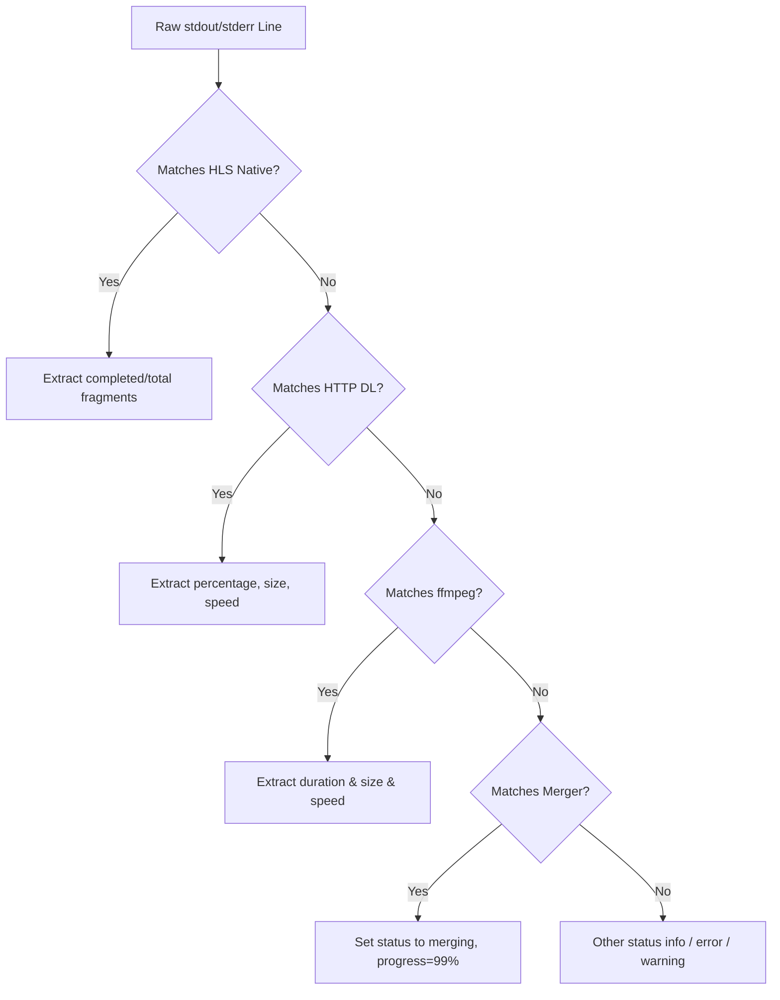
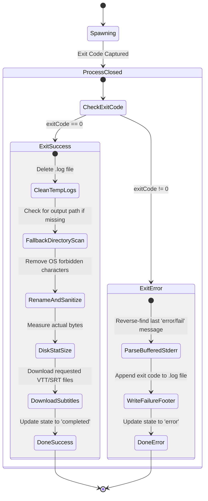

# Streambert Media Downloading Architecture

Streambert is an Electron-based desktop application designed for ad-free streaming and downloading of movies, TV shows, and anime. To circumvent browser sandbox limitations and run heavy networking/transcoding tasks, Streambert offloads the downloading process to a native CLI tool running as a spawned child process. 

This document details the complete end-to-end mechanism of how Streambert downloads media, parses progress, handles subtitles, enforces security, and cleans up local storage.

---

## 1. High-Level Architecture Overview

Streambert divides downloading responsibilities between its **Renderer** and **Main** processes to ensure responsive user interfaces and secure command executions.

```mermaid
sequenceDiagram
    participant R as Renderer Process (UI)
    participant M as Main Process (Electron Node.js)
    participant B as Downloader Binary (vid-dl-cli-only)
    participant S as Subtitle APIs (SubDL / Wyzie)

    R->>M: check-downloader (folderPath)
    M-->>R: token (UUID) / Validation Status
    Note over R, M: Token avoids exposing the absolute executable path to Renderer

    R->>M: run-download (m3u8Url, token, metadata, subtitles)
    M->>M: Create Temp Log File
    M->>B: Spawn process with CLI args
    activate B

    rect rgb(30, 30, 30)
        Note over M, B: Real-time Progress Scraping
        B-->>M: stdout / stderr (raw lines)
        M->>M: Regex Parse Progress/Speed/Size
        M->>M: Append to Log File
        M-->>R: download-progress IPC Event
    end

    B->>M: close (exitCode)
    deactivate B
    
    alt exitCode == 0
        M->>M: Rename & Sanitize Video File
        M->>S: Fetch Subtitle files (direct or ZIP)
        S-->>M: Subtitle binary data
        M->>M: Decompress & Save subtitles (.srt / .vtt)
        M->>M: Delete Temp Log
        M-->>R: download-progress (completed)
    else exitCode != 0
        M->>M: Parse stderr for failure reason
        M->>M: Save Temp Log
        M-->>R: download-progress (error)
    end
    M->>M: saveDownloads() to downloads.json
```



---

## 2. Downloader Utility Integration (`vid-dl-cli-only`)

Streambert does not write a custom downloader protocol client in Node.js. Instead, it relies on **`vid-dl-cli-only`** (hosted at `https://github.com/truelockmc/vid-dl-cli-only`), which is a PyInstaller-packaged application wrapping `yt-dlp` and `ffmpeg` configured for headless, terminal-only execution.

### Downloader Validation (`check-downloader`)
When users set up downloads, they must point Streambert to the folder containing `vid-dl-cli-only`. The Main process handles this folder validation:
1. It verifies the selected folder contains a `_internal` directory (the standard layout for a PyInstaller multi-file package).
2. It looks for the OS-appropriate binary:
   - **Windows**: Files ending in `.exe`.
   - **Unix/Linux**: Files with executable flags set (`stat.mode & 0o111`).
3. **Security Boundary Token**: To prevent renderer compromised code injection, the absolute path to the binary is kept strictly in the Main process's private memory using a map:
   ```javascript
   const token = crypto.randomUUID();
   trustedBinaryPaths.set(token, path.join(folderPath, binary));
   ```
   Only the token UUID is returned to the renderer, meaning the frontend can never execute arbitrary commands by tampering with the binary path.

---

## 3. Spawn Configurations and Command Arguments

When the download is initialized, the Main process invokes the binary via Node's `child_process.spawn`.

### Command Arguments
The spawned binary receives the following parameters:
```javascript
const args = [
  "--cli",                  // Run in CLI mode, optimized stdout
  m3u8Url,                  // Source manifest URL (HLS playlist)
  "-f", "mp4 (with Audio)", // Request target formats (video + audio)
  "-r", "best",             // Best video resolution available
  "-b", "320",              // Audio bitrate constraint (320 kbps)
  "-n", name,               // Destination file name
  "-d", downloadPath,       // Target output directory
];
```

---

## 4. Logging & stdout/stderr Scraping Pipeline

Because standard download utilities print progress information to `stdout` or `stderr`, Streambert spawns the process with piped streams: `stdio: ["ignore", "pipe", "pipe"]`.

### Temporary Log Management
A unique temporary log file is generated in the OS temp directory for every active download task:
- Path: `path.join(os.tmpdir(), "streambert_dl_<UUID>.log")`
- Initial structure includes metadata: URL, started timestamp, and media name.
- Every chunk of stdout/stderr data is buffered, separated into lines, and appended to this file.

### Regex Scraping Logic
To update the GUI in real-time, every stdout/stderr line is scanned against regular expressions. The parser handles three primary phases of downloading:



#### A. HLS Segment-by-Segment Downloads
For streams served via HLS playlists (.m3u8), progress is updated based on fragment completion counts.
- **Total Fragments Detection**:
  - Regex: `/Total fragments:\s+(\d+)/`
  - Purpose: Sets the scale limit (total number of parts to download).
- **Fragment Completion**:
  - Regex: `/\(frag\s+(\d+)\/(\d+)\)/`
  - Example output line: `[hlsnative] (frag 45/200)`
  - Metrics Extracted: `completedFragments = 45`, `totalFragments = 200`.
  - Progress: `Math.round((completedFragments / totalFragments) * 100)`. capped at 99%.

#### B. Direct Single-File Downloads (MP4/WebM)
When downloading flat files directly instead of chunked HLS playlists:
- Regex: `/^\[download\]\s+([\d.]+)%\s+of\s+~?\s*([\d.]+\s*(?:[KMGT]i?B|B))/i`
- Example output line: `[download]  23.4% of  450.25MiB at   5.23MiB/s ETA 01:15`
- Metrics Extracted: `progress = Math.round(23.4)`, `size = 450.25 MiB`, `speed = 5.23 MiB/s`.

#### C. ffmpeg Merging & Transcoding
Once streams are fully downloaded, `yt-dlp` packages them using `ffmpeg`. This phase is captured dynamically:
- **Total Duration Discovery**:
  - Regex: `/Duration:\s*(\d+):(\d+):([\d.]+)/`
  - Purpose: Calculates total video length in seconds (`HH*3600 + MM*60 + SS`).
- **Processing Progress**:
  - Regex: `/size=\s*([\d.]+\s*\w+)\s+time=(\d+):(\d+):([\d.]+)/i`
  - Example output line: `frame= 1200 fps= 60 q=-1.0 size=   45200kB time=00:10:30.22 bitrate= 587.2kbits/s speed= 3.2x`
  - Metrics Extracted: Converts elapsed time (`10m 30.22s`) and matches it against total duration to yield a precise merger progress percentage. Also parses speed multiplier (`3.2x`).
- **Merger Completion**:
  - Regex: `/\[Merger\] Merging formats into "(.+)"/`
  - Purpose: Captures final target container name, sets progress to `99%` and status message to `"Merging..."`.

#### D. Failure and Retries
- Regex: `/Retrying\s+\((\d+)\/(\d+)\)/i` or `/Read timed? out/i`
- Purpose: Updates status warning (e.g. `Retrying... (1/3)`) and drops reported speed to `0 MB/s`.

---

## 5. Post-Processing & File Cleanup

Upon process exit (detected via the child process `close` event handler), the system invokes final processing steps depending on the outcome:



### Exit Success Flow (exitCode == 0)
1. **Log Cleanup**: Deletes the `.log` file from the temporary directory.
2. **Fallback Directory Scan**: If the stdout parsing failed to capture the exact file location, the app scans the target folder, filters by video extensions (`.mp4`, `.mkv`, `.webm`, `.avi`, `.ts`, `.m4v`), measures their modifications times, and selects the newest file.
3. **File Sanitization**: Renames the output file to remove OS-forbidden characters:
   ```javascript
   const safeName = name.replace(/[<>:"/\\|?*\x00-\x1f]/g, "").replace(/\s+/g, " ").trim();
   ```
4. **Physical Size Verification**: Instead of relying on reported CLI strings, it triggers `fs.statSync(filePath).size` to update the database database with precise bytes.
5. **Subtitle Association**: Resolves and triggers subtitle downloads (see Section 6).

### Exit Error Flow (exitCode != 0)
1. **Error Extraction**: Streambert reverses the accumulated stderr buffer and looks for lines matching key error terms: `/error|failed|unable|cannot|denied/i`.
2. **Log Persistence**: The temp log file is preserved and a footer showing the exit status is appended (`Failed: exit code <N>`).
3. **Task State Updates**: Sets the download entry status to `error` and sets `lastMessage` to the extracted error string alongside the exit code.

---

## 6. Subtitles Fetching & ZIP Extraction System

Streambert supports downloading subtitles both concurrently on video download completion, or retrospectively via a dedicated `"download-subtitles-for-file"` IPC handle.

### Subtitle Search APIs
Subtitles are queried from two providers:
1. **SubDL** (`api.subdl.com`): API key authenticated. Searches via TMDB IDs and returns subtitle download metadata.
2. **Wyzie** (`sub.wyzie.io` / `subs.wyzie.ru`): Public or token-authenticated search interface.

### In-Memory ZIP Extraction
SubDL returns subtitles packed inside `.zip` files. Rather than invoking external unzip tools or writing folders to disk, Streambert implements a custom, dependency-free in-memory ZIP parser:

1. **ZIP Header Matching**: Loops through the binary buffer checking for local file header signatures: `0x50 0x4b 0x03 0x04` (`PK\x03\x04`).
2. **Compression Metadata Parsing**: Reads binary indexes:
   - Compression method (offset +8)
   - Compressed size (offset +18)
   - File name length (offset +26)
   - Extra fields length (offset +28)
3. **Target Selection**: Checks file names. If it matches extensions `.srt`, `.vtt`, `.ass`, or `.ssa`, it targets the entry.
4. **Decompress Execution**:
   - **Method 0 (Stored)**: Directly slices the buffer.
   - **Method 8 (Deflated)**: Decompresses the sliced buffer using Node's built-in `zlib.inflateRawSync`.
5. **Decompression Bomb Protection**: Caps the maximum decompress buffer allocation to `10 MB` (`ZIP_MAX_OUTPUT_BYTES = 10 * 1024 * 1024`). Any files exceeding this boundary are safely skipped.
6. **Temporal Writing**: Writes the file to the temp directory under `streambert_sub_<timestamp>_<name>` and schedules a automatic timer to delete it after 5 minutes (`TEMP_SUB_TTL_MS = 300000`).

### Final Association
Once subtitles are retrieved, they are named identically to the video file but appended with their language suffix and written to the video's directory:
- Example: `/Downloads/MovieName.mp4` -> `/Downloads/MovieName.en.srt` (or `/Downloads/MovieName.es.1.srt` if duplicates exist).

---

## 7. Lifecycle Cleanup and Deletion

Streambert guarantees filesystem consistency during cancels, exits, and manual deletions.

### 1. Active Task Interruptions (`killAllDownloads` / app quit)
If the application is closed or if the user cancels a download:
- Spits out a `SIGKILL` signal to terminate the spawned CLI process.
- Changes task state to `error` and saves `"Cancelled on exit"` as the final status message.
- Runs a directory clean-up sweep on the download paths. It searches for and unlinks incomplete fragments/metadata files matching:
  - `/\.part$/`
  - `/\.part\.\d+$/`
  - `/\.part\.tmp$/`
  - `/\.tmp$/`
  - `/\.ytdl$/`
  - `/\.part-Frag\d+$/`

### 2. Manual Deletions (`delete-download` / `delete-all-downloads`)
- Kills any active spawned process using `SIGKILL`.
- Unlinks the main video file (`filePath`).
- Loops through the `subtitlePaths` array and unlinks every individual translation file.
- Performs a final sweep for lingering temporary file fragments (like `.part`, `.ytdl`).
- Erases the entry metadata from `downloads.json`.

---

## 8. Summary of Relevant IPC Handles

Below is a reference guide for all IPC triggers defined in `src/ipc/downloads.js` and `src/ipc/subtitles.js`:

| IPC Event | Channel Type | Purpose | Parameters | Returns |
| :--- | :--- | :--- | :--- | :--- |
| `check-downloader` | Handle | Validates selected directory for pyinstaller folders and binary files; maps a secure UUID token. | `folderPath` | `{ exists: boolean, token?: string, reason?: string }` |
| `run-download` | Handle | Spawns downloader CLI, establishes logs, and monitors execution. | `{ token, m3u8Url, name, downloadPath, mediaId, mediaType, subtitles, ... }` | `{ ok: boolean, id?: string, error?: string }` |
| `get-downloads` | Handle | Fetches all recorded downloads in queue. | *None* | `DownloadEntry[]` |
| `delete-download` | Handle | Aborts process, cleans up temp fragments, unlinks files/subs, and deletes database history. | `{ id, filePath }` | `{ ok: boolean }` |
| `delete-all-downloads` | Handle | Clears and unlinks every completed file/subtitle in database. | *None* | `{ ok: boolean, deleted: number, errors: number }` |
| `get-downloads-size` | Handle | Calculates cumulative disk usage of all downloaded files. | *None* | `{ bytes: number }` |
| `scan-directory` | Handle | Traverses folder (depth limit = 3) looking for existing video files. | `folderPath` | `LibraryFile[]` |
| `search-subtitles` | Handle | Queries SubDL and Wyzie APIs for matching files. | `{ tmdbId, mediaType, season, episode, languages, subdlApiKey, wyzieApiKey }` | `{ ok: boolean, results: SubtitleResult[], error?: string }` |
| `get-subtitle-url` | Handle | Resolves direct link or extracts SubDL ZIP into temp folder. | `{ fileId }` | `{ ok: boolean, url: string, file_name: string }` |
| `download-subtitles-for-file` | Handle | Downloads/saves subtitles for an already completed video file. | `{ filePath, selectedSubs }` | `{ ok: boolean }` |
